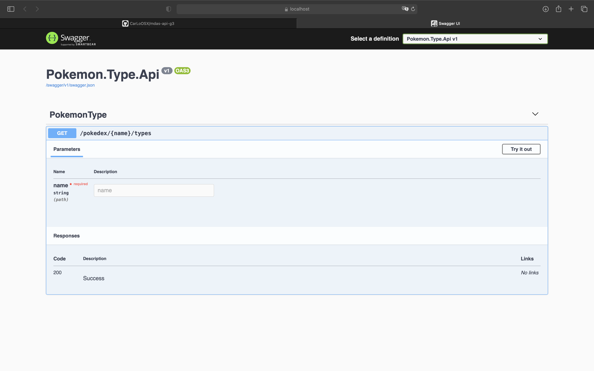

# LaSalle - Diseño del software II 🎓🏭

# PokeApi 🎮 


# Content 📇

* 1. Challenge
* 2. Folder structuring
* 3. Install 
* 4. Results


# 1. Challenge 🤔💭

### Requirements:

* API: https://pokeapi.co
* Given the name of the pokemon return the type by:
  * Console - Terminal
  * Via Endpoint Http Body Json
* Control exceptions (Pokemon not found, PokeApi is down).
* The input via argument has to continue to work even if the api is down.

### Design:

* Commits bounded
* One class per file
* Create the classes strictly necessary to avoid duplicating the logic of the use case.


# 3. Folder Structure 📂

* Boundend context: Objetivo dividir y aislar los modelos de dominio
  * Module: Conceptos dentro de un bounded context
    * Capa Infraestructura
    * Capa Application
    * Capa Domain
      *  Value Objects: Objetos de nuestra aplicación


# 3. Install 🔧 

* Dotnet is required to build and run the app, you can downloand from official page (we recommend 5.0):
https://dotnet.microsoft.com/download/dotnet/5.0


## Console 🖥️
```git clone https://github.com/CarLoOSX/mdas-api-g3```
### Execute the following commands
```
cd mdas-api-g3
cd src/main/Pokedex/Context/Pokemons/Types/Infrastructure/Pokemons.Types.CliConsole/
```
### Compile the app
```dotnet build Pokemons.Types.CliConsole.csproj```
### Run the app and pass the pokemon as argument
```dotnet run charizard```

## Api Rest 🌐

### Execute the following commands
```
cd mdas-api-g3
cd src/main/Pokedex/Context/Pokemons/Types/Infrastructure/Pokemons.Types.Api
```
### Compile the app
```dotnet build Pokemons.Types.Api.csproj```
### Run the app
```dotnet run Pokemons.Types.Api.csproj```
### Go to
```https://localhost:{PORT}/swagger/index.html```

# 4. Results 📷
## Charizard example 🔥:
## Console 🖥️


## Swagger - Api Rest 🌐

